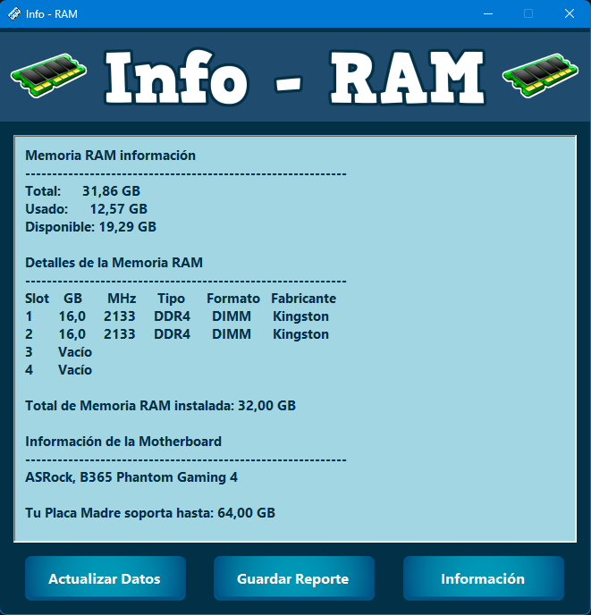

# Info-RAM: Herramienta de Diagnóstico de Hardware

<!-- Badges -->
[](https://github.com/Pablitus666/Info-RAM/releases)
[](LICENSE) <!-- Assuming a LICENSE file will be added or it's just a statement -->


**Info-RAM** es una aplicación de escritorio robusta y fácil de usar, desarrollada en C# con .NET 8 y Windows Forms. Está diseñada para proporcionar a usuarios y técnicos información técnica detallada sobre la memoria RAM y la placa base (motherboard) de cualquier sistema Windows.

## 📖 Tabla de Contenidos
- [✨ Características Principales](#-características-principales)
- [📷 Capturas de pantalla](#-capturas-de-pantalla)
- [🖥️ Requisitos del Sistema](#-requisitos-del-sistema)
- [🚀 Instalación y Uso](#-instalación-y-uso)
- [🛡️ Seguridad y Confianza](#-seguridad-y-confianza)
- [📝 Guardar Reporte](#-guardar-reporte)
- [🔒 Licencia](#-licencia)
- [👨‍💻 Autor](#-autor)

---

## ✨ Características Principales

*   **Análisis Exhaustivo de Memoria RAM:**
    *   Identificación de fabricante, tipo (DDR, DDR2, DDR3, DDR4, DDR5, etc.), formato (DIMM, SO-DIMM).
    *   Detalles sobre capacidad total, velocidad, uso actual y slots disponibles.
*   **Información Detallada de la Placa Base:**
    *   Muestra el modelo y fabricante de la motherboard.
*   **Interfaz de Usuario Intuitiva y Moderna:**
    *   Diseño limpio con paneles estilizados y una paleta de colores profesional.
    *   Integración de iconos e imágenes de alta calidad directamente en el ejecutable.
    *   Botones interactivos con diseño atractivo para una experiencia de usuario mejorada.
*   **Funcionalidades Clave:**
    *   **Actualización en Tiempo Real:** Refresca la información del hardware con un solo clic.
    *   **Generación de Reportes:** Exporta un informe técnico completo a un archivo de texto (`Reporte_RAM.txt`), incluyendo un banner ASCII personalizado.
    *   **Información del Desarrollador:** Acceso rápido a los datos del autor de la aplicación.

## 📷 Capturas de pantalla

<p align="center">
  
</p>

Pantalla principal de InfoRAM mostrando datos de la memoria RAM y motherboard.

## 🖥️ Requisitos del Sistema

*   **Sistema Operativo:** Windows 8, Windows 10 o Windows 11 (64-bit).
*   **Framework:** .NET 8.0 Runtime.

## 🚀 Instalación y Uso

### Ejecutable Precompilado

1.  Descarga el archivo `InfoRAM.zip` desde la sección [**Releases**](https://github.com/Pablitus666/Info-RAM/releases) del repositorio de GitHub.
2.  Descomprime el archivo `InfoRAM.zip`.
3.  Ejecuta `InfoRAM.exe` desde la carpeta descomprimida.

### Compilación desde el Código Fuente

1.  Clona el repositorio:
    ```powershell
    git clone https://github.com/Pablitus666/Info-RAM.git
    ```
2.  Abre la solución `InfoRAMApp.sln` con Visual Studio 2022 o una versión posterior.
3.  Compila el proyecto en configuración `Release`.
4.  El ejecutable se encontrará en el directorio `bin/Release/net8.0-windows/`.

## 🛡️ Seguridad y Confianza

**¡Su privacidad y la integridad de su sistema son nuestra prioridad!**

Entendemos que descargar software de internet puede generar dudas. Por ello, queremos ser completamente transparentes sobre la seguridad de Info-RAM:

*   **Código Limpio y Verificado:** Info-RAM ha sido desarrollada con un enfoque en la transparencia. El código fuente completo está disponible en este repositorio de GitHub, invitando a la comunidad y a expertos en seguridad a revisarlo para verificar su integridad y ausencia de funciones ocultas o maliciosas.

*   **Sin Conexiones a Internet:** La aplicación funciona de manera 100% offline. No necesita ni intenta conectarse a internet, garantizando que sus datos y su privacidad permanezcan en su equipo.

*   **Firma Digital (Autofirmada):** El ejecutable de Info-RAM está firmado digitalmente. Es importante destacar que, al ser un desarrollador independiente, el certificado utilizado es autofirmado. Esto puede generar una advertencia inicial por parte de Windows o su software antivirus. Sin embargo, esta firma garantiza que el archivo que ha descargado no ha sido modificado ni manipulado por terceros desde que fue publicado.

*   **Diseño Minimalista:** Info-RAM se enfoca exclusivamente en su función principal: proporcionar información de hardware. No incluye funcionalidades adicionales que puedan comprometer el rendimiento o la seguridad de su sistema.

> ✅ **Nota sobre las advertencias:** Es posible que Windows o su antivirus muestren una advertencia de seguridad al intentar ejecutar la aplicación. Si ve un mensaje como "Windows protegió su PC", puede hacer clic en "Más información" y luego en "Ejecutar de todas formas" con total tranquilidad, sabiendo que la aplicación es segura y ha sido verificada.

## 📝 Guardar Reporte

La aplicación permite guardar un reporte técnico detallado de la configuración de RAM y placa base de tu sistema. Este reporte se guarda como un archivo `Reporte_RAM.txt` e incluye un banner ASCII distintivo al inicio.

Ejemplo del banner incluido en el reporte:

```
_ _ _ _ _ _ _ _ _ _ _ _ _ _ _ _ _ _ _ _ _ _ _ _ _ _ _ _ _ _
	 ____       _     _ _ _
	|  _ \ __ _| |__ | (_) |_ _   _ ___
	| |_) / _  | '_ \| | | __| | | / __|
	|  __/ (_| | |_) | | | |_| |_| \__ \_ _ _
	|_|   \__,_|_.__/|_|_|\__|\\__,_|___(_|_|_)
_ _ _ _ _ _ _ _ _ _ _ _ _ _ _ _ _ _ _ _ _ _ _ _ _ _ _ _ _ _
```

## 🔒 Licencia

Este proyecto es de naturaleza **propietaria**. Queda estrictamente prohibido su uso, distribución o modificación sin la autorización expresa del autor.

## 👨‍💻 Autor

*   **Nombre:** Pablo Téllez
*   **Contacto:** pharmakoz@gmail.com